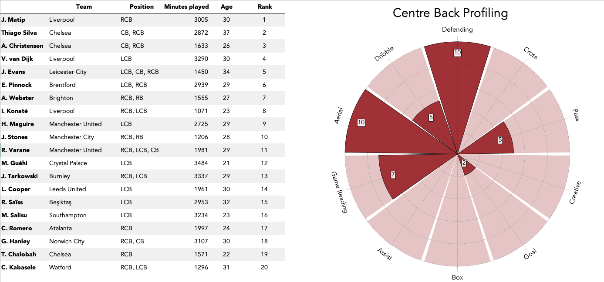
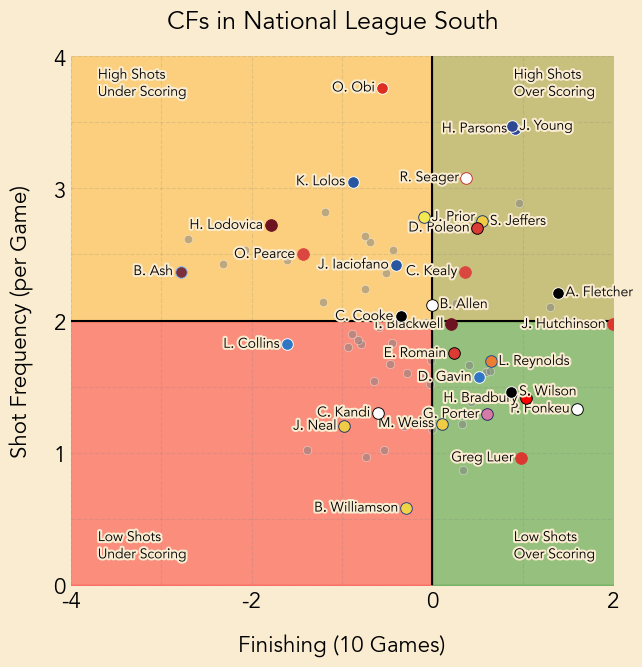
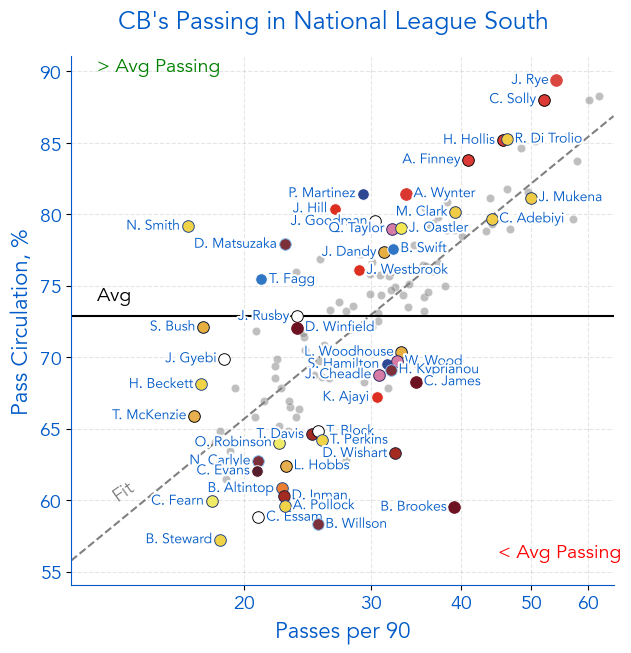
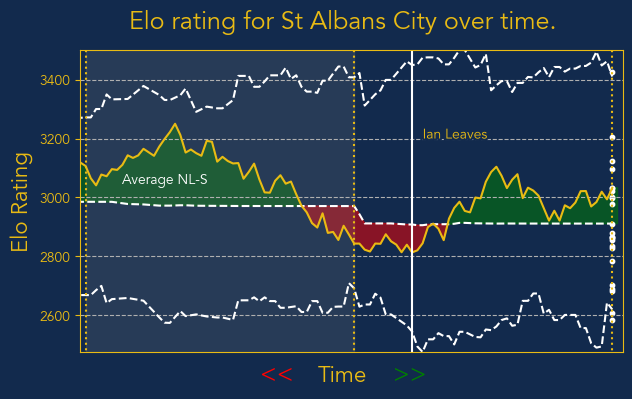
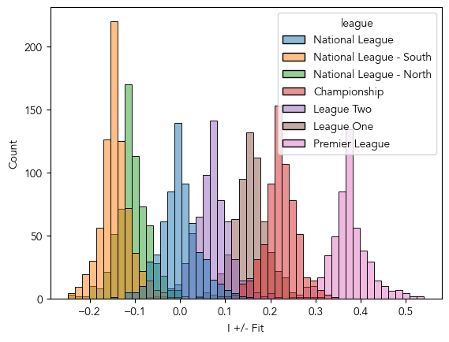
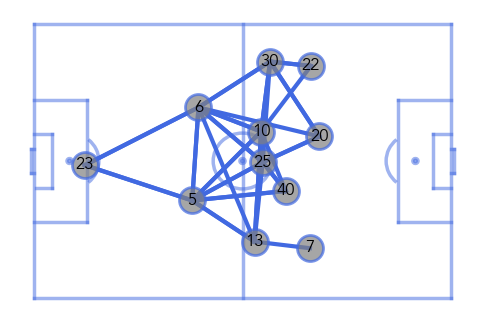
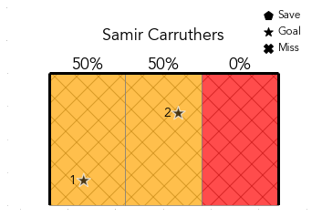
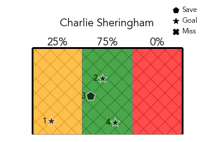
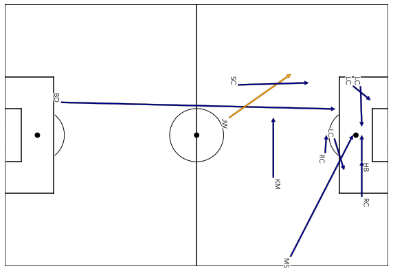

# Olly Whaites Football Data Portfolio

# [Visualisations for Player Statistics](https://ollywhaites.github.io/football-stats-vis/)

This is a project which I have developed for technical scouting of football players using their statistics. It presents **player radars**, **pizza plots** and **distribution plots**; three different methods of visualising football player's statistics. Each method is compared, highlighting their the pros and cons. A combination of all methods helps give a clear overview of the quality and playstyle of a player.

The full report is found by clicking the link in the title. Alternatively, solely the visualisations are found [here](https://github.com/ollywhaites/football-stats-vis/tree/main/Plots). As an example, a radar plot is shown below.

## Example of Player Radar 

# [Player Profiling using Weighted Average](https://ollywhaites.github.io/weighted-avg-ranking/)

This project highlights a method of profiling and ranking players using their statistics, explicitly from the Wyscout platform. It presents a way of catagorising statitsics to profile playing positions and using these profiles to rank the best players for this position. 

The full report is found by clicking the link in the title. Alternatively, any visualisations are found [here](https://github.com/ollywhaites/weighted-avg-ranking/tree/main/images). An example of this for CB's in the Premier League is shown below.

## Example of Player Profiling 

# [Scattergraphs for Player Scouting](https://ollywhaites.github.io/scattergraph-pl-scouting/) 

This project highlights a method of technically scouting players by comparing two particular statitsics. Here the use of scattergraphs is explained and they are utilised to visualise the most valued players. Additionally, they may be used to understand the style of play of a player. 

The full report is found by clicking the link in the title. Unfortunately, this report is still under construction. Any of the scattergrams are found [here](https://github.com/ollywhaites/scattergraph-pl-scouting/tree/main/images). Two examples of scattergrams to highlight valuable players is shown below.

## Example of a Scattergram For Strikers

## Example of a Scattergram For CB Passing 

# Predicting Match Outcomes 

This project will highlight the multiple machine learning models developed to predict football matches using historical scoresheet data. The two models developed here are a head-to-head Elo method for ranking teams and a player +/- score method for ranking players. The Elo method was show to have an accuracy of ~60% at predicting matches where as the current +/- has a ~50% accuracy.

Unfortunately, this report is still under construction and is not ready to present. Below are visualisations of the methods:

## Example of a Elo Ranking

## Example of a +/- Ranking

# Opposition Analysis 

Here are a few examples of data visualisations I have created for opposition analysis. 

Unfortunately, this report is still under construction and is not ready to present.

## Example of a Pass Network

## Example of a penalty tagging

## Example of a previous assits

