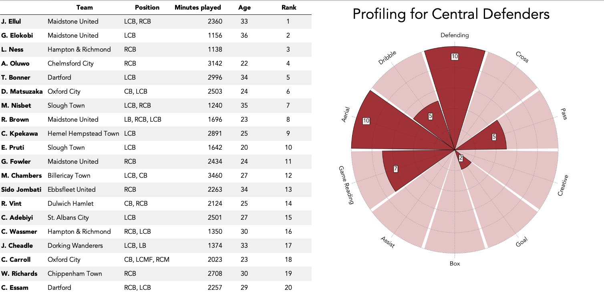
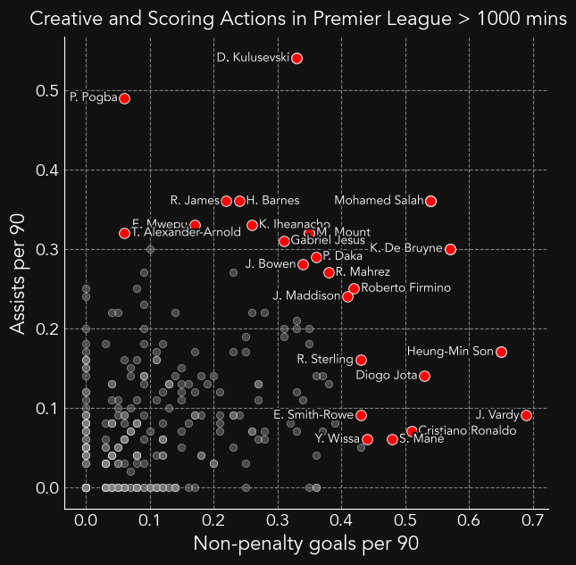
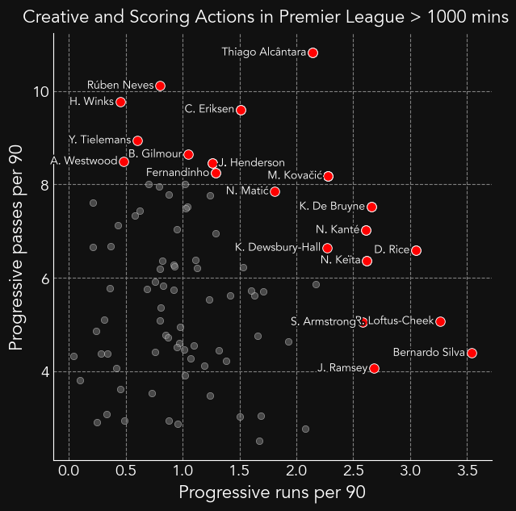

# Olly Whaites Football Data Portfolio

# [Visualisations for Player Statistics](https://ollywhaites.github.io/football-stats-vis/)

This is a project which I have developed for technical scouting of football players using their statistics. It presents **player radars**, **pizza plots** and **distribution plots**; three different methods of visualising football player's statistics. Each method is compared with the pros and cons demonstrated. A combination of all methods helps give a clear overview of the quality and playstyle of a player.

The full report is found by clicking the link in the title. Alternatively, the visualisations only are found [here](https://github.com/ollywhaites/football-stats-vis/tree/main/Plots). As an example, the radar plot is shown below.

## Example of Player Radar 

# [Player Profiling using Weighted Average](https://ollywhaites.github.io/weighted-avg-ranking/)

This project highlights a method of profiling and ranking players using their statistics, explicitly from the Wyscout platform. It presents a way of catagorising statitsics to profile playing positions and using these profiles to rank the best players for this position. 

The full report is found by clicking the link in the title. Alternatively, any visualisations are found [here](). An example of this for CB's in the Premier League is shown below.

## Example of Player Profiling 

# [Scattergraphs for Player Scouting]()

This project highlights a method of technically scouting players by comparing two particular statitsics. Here the use of scattergraphs is explained and they are utilised to visualise the most valued players. Additionlly, they may be used to understand the style of play of a player. 

The full report is found by clicking the link in the title. Alternatively, any visualisations are found [here](). Two examples of scattergrams for highlighting valuable players are shown bellow.

## Example of a Scattergram For Attacking Actions

## Example of a Scattergram For Midfielder Actions 

# [Expected models to Evaluate Players]()

