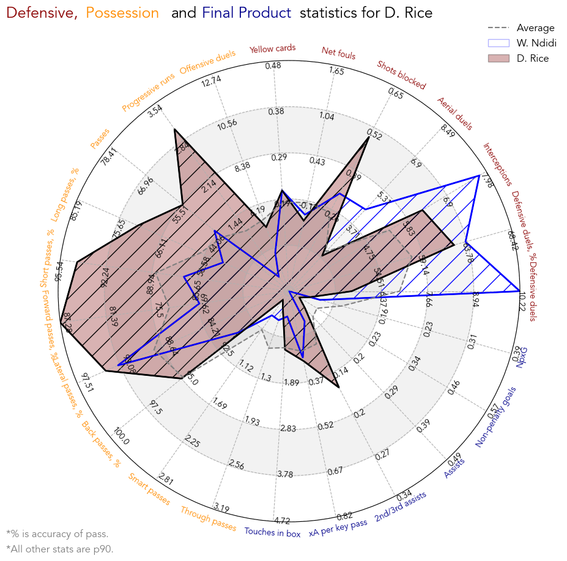

# Olly Whaites Football Data Portfolio

# [Player Statistics Visualisations](https://github.com/ollywhaites/football-stats-vis)

This is a project which I have developed for technical scouting of football players using their statistics. It presents **player radars**, **pizza plots** and **distribution plots**; three different methods of visualising football player's statistics. Each method is compared with the pros and cons demonstrated. A combination of all methods helps give a clear overview of the quality and playstyle of a player.

The full report is found by clicking the link in the title, where the file '*plots*' in link's repository contains examples of the plots. As an example, the radar plot is shown below.

## Player Radar 

